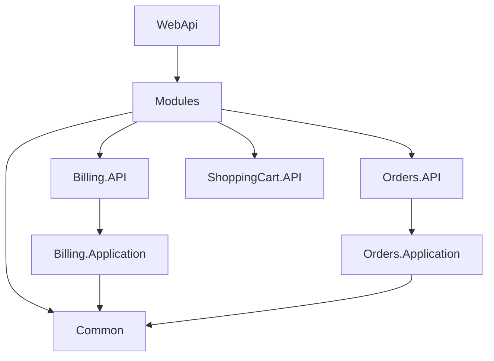

```mermaid
flowchart TD
    WebApi["WebApi"]

    Modules["Modules"]

    Common["Common"]

    BillingAPI["Billing.API"]
    BillingApp["Billing.Application"]

    OrdersAPI["Orders.API"]
    OrdersApp["Orders.Application"]

    CartAPI["ShoppingCart.API"]

    WebApi --> Modules

    Modules --> BillingAPI
    Modules --> OrdersAPI
    Modules --> CartAPI
    Modules --> Common

    BillingAPI --> BillingApp
    OrdersAPI --> OrdersApp

    BillingApp --> Common
    OrdersApp --> Common
```