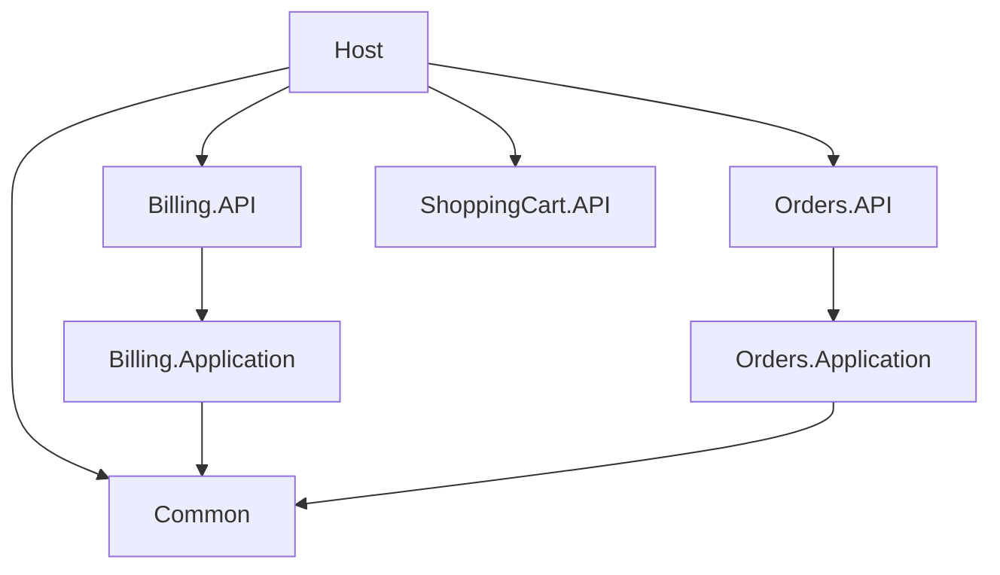

```mermaid
flowchart TD
    Host["Host"]

    Common["Common"]

    BillingAPI["Billing.API"]
    BillingApp["Billing.Application"]

    OrdersAPI["Orders.API"]
    OrdersApp["Orders.Application"]

    CartAPI["ShoppingCart.API"]

    Host --> BillingAPI
    Host --> OrdersAPI
    Host --> CartAPI
    Host --> Common

    BillingAPI --> BillingApp
    OrdersAPI --> OrdersApp

    BillingApp --> Common
    OrdersApp --> Common

```