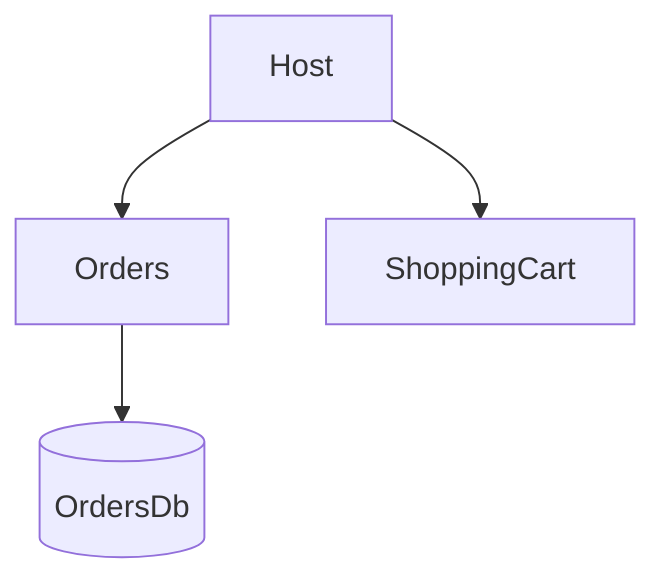

# TO DO:

- Add open telemetry https://tiagotartari.net/dotnet-como-analisar-e-interpretar-as-metricas-de-runtime-do-dotnet.html
- Change SqlServer to postgres
- Add Nginx
- Separate domain models from data models
- Configure Keycloak with realms, clients, roles, and users
- Create the front end and implement user authentication
- Add RabbitMQ
- Create an Order Created event and fan it out to the billing and email modules
- Implement an outbox pattern to handle RabbitMQ downtime
- Handle consumer failures and ensure idempotency

# Project Structure

## Host

- Serves as the entry point of the application.
- Knows all module entry points (Module APIs) and invokes them to configure each module.

### Don't make asynchronous communication between modules

- A module that only exists to react asynchronously usually does NOT belong in the same modular monolith.

 

### Synchronous access points

- Synchronous calls to other modules via well-defined interfaces.
- APIs are not used to avoid unnecessary HTTP overhead for in-process calls.

### Modules

- Each module has its own database.
- Modules should make most of the classes internal to avoid unintended access from other modules.
- Modules do not bypass other bounded contexts to access databases or functionality directly.