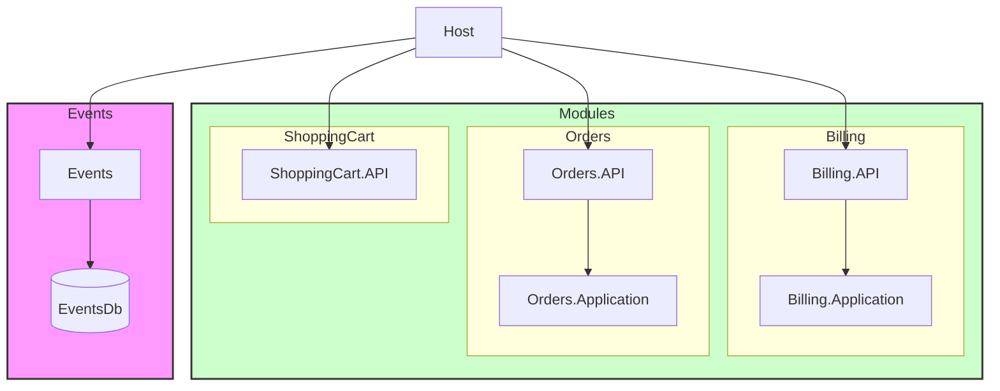

# Project Structure

## Host

- Serves as the entry point of the application.
- Knows all module entry points (Module APIs) and invokes them to configure each module.

## Common

- Contains DTOs and event classes used for cross-module communication via asynchronous event messages or synchronous access points.

### Asynchronous event messages

- Fire-and-forget events that are published to an event bus and handled by other modules.

### Synchronous access points

- Synchronous calls to other modules via well-defined interfaces.
- APIs are not used to avoid unnecessary HTTP overhead for in-process calls.

### Modules

- Each module has its own API, Application, Domain, and Infrastructure layers/libraries.
- Each module has its own database.
- Modules communicate with each other via asynchronous event messages or synchronous access points.
- Modules do not bypass other bounded contexts to access databases or functionality directly.

## Notes

- Application running in visual studio or docker
- Update database using scripts from \database\tables.sql

Access database in visual studio:

- server name: localhost,1433 
- Database=EventsDb
- User Id=sa
- Password=YourStrong!Passw0rd